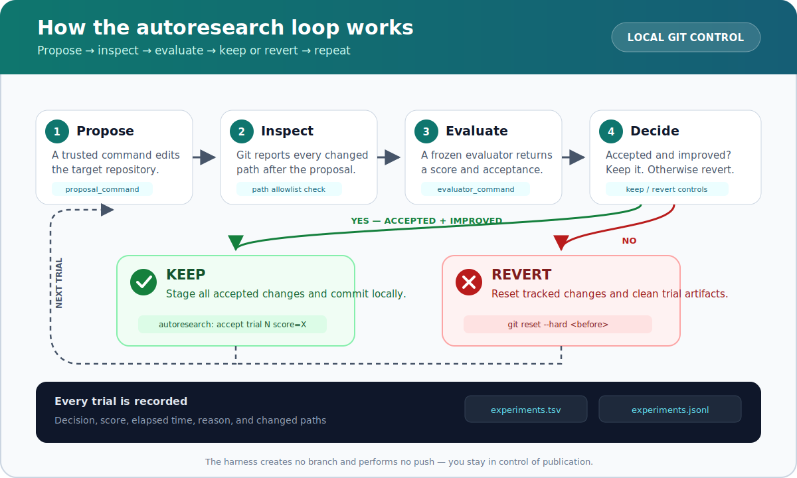

Hermes Autoresearch Harness
===========================

Hermes Autoresearch repeatedly lets an agent change a Git repository, measures whether each
change improved a score, and automatically keeps good changes as local commits or reverts the
rest. It is a reusable control loop for testing code, configuration, prompts, or other
repository-based experiments without automatically pushing anything to GitHub.

How it works
------------



What it provides
- Proposal loop with configurable commands (provider/agent-command agnostic)
- Evaluator contract parsing (JSON in stdout)
- Git-backed safety: keep/revert semantics with configurable strategy
- Concise TSV and JSONL experiment logs
- Configurable edit allowlist (path safety)
- Time/budget stop conditions and early-stop on score target

No `program.md` is included in this repository. You will supply your own proposal/evaluation
program later.

Safety notice
-------------

This harness executes the proposal and evaluator commands you configure with the permissions
of your current user. Only run trusted commands against repositories you are prepared to
modify. The path allowlist checks repository changes after each command finishes; it is a
keep/revert control, not an operating-system sandbox. It does not prevent network access or
writes outside the target repository.

Installation
------------

```bash
python -m venv .venv
source .venv/bin/activate
python -m pip install .
```

Quick start
1. Configure your proposal and evaluator commands in a JSON config.
2. Keep your project repository clean before running.
3. Create or switch to a dedicated experiment branch.
4. Ensure `runs/` is ignored by the target repository.
5. Run the harness.

Example config
-------------

```json
{
  "repo_path": ".",
  "proposal_command": ["python3", "examples/proposal_command_example.py"],
  "evaluator_command": ["python3", "examples/evaluator_contract_example.py"],
  "max_trials": 5,
  "stop_after_no_improve": 2,
  "min_improvement": 0.0,
  "allowlist_relative_paths": ["."]
}
```

Run
---

```bash
python -m hermes_autoresearch.cli --config examples/example_config.json
```

Evaluator contract
-----------------

Evaluator command should print JSON to stdout. Example:

```json
{"score": 12.3, "accepted": true, "reason": "tests pass", "metrics": {"coverage": 0.91}}
```

Required:
- `score` must be numeric.

Optional:
- `accepted` defaults to true
- `reason` human-readable note
- `metrics` object

Environment variables provided to proposal/evaluator
- `AR_TRIAL`: 1-based trial number
- `AR_PHASE`: `proposal` or `evaluate`
- `AR_REPO_PATH`: absolute repository path
- `AR_PREVIOUS_SCORE`: current best score or empty

Behavioral knobs
----------------

- `keep_on_improve` (default: true): keep only when the score improves by
  `min_improvement` over best.
- `revert_on_no_improve`: revert git state when proposal/eval fails or score does not
  meet acceptance rule.
- `revert_on_failure`: revert when proposal/evaluator command fails.
- `allowlist_relative_paths`: list of repo-relative paths that may be edited. Any change
  outside this list is reverted as a safety control.
- `max_trials`: upper limit of iterations.
- `max_seconds`: wall-time budget.
- `target_score`: stop early on reaching this score.
- `stop_after_no_improve`: stop after N consecutive no-improve trials.

Logging
-------

- TSV: `runs/experiments.tsv`
- JSONL: `runs/experiments.jsonl`

Each row includes status/decision, score, best_score, reason, elapsed_ms, changed paths.

Accepted improvements are committed locally to the target repository's currently checked-out
branch with messages such as `autoresearch: accept trial 3 score=12.5`. The harness never
creates a branch or pushes commits. Rejected trials are reverted when the corresponding revert
setting is enabled. Because accepted trials are staged with `git add -A`, the target repository
should ignore `runs/` if experiment logs must remain outside commits.

Testing
-------

```bash
pytest -q
```

You should see pass/fail output and fixture-backed proofs of:
- kept vs reverted trials
- allowlist enforcement

Trial contract pattern
----------------------

For agent-based proposals, the repository ships a reusable trial contract at
`contracts/trial_contract.md`. It requires the proposal agent to:

- pursue exactly one hypothesis per trial
- modify only the stated allowlisted paths
- leave changes uncommitted for the evaluator
- exit nonzero when blocked
- never pursue a second hypothesis in the same trial

`examples/proposal_wrapper_example.py` combines that contract with the harness-provided trial
metadata, an explicit objective, and the allowed paths. It then appends the resulting prompt to a
configurable argv prefix and executes it directly without a shell.

The wrapper requires two caller-supplied environment variables:

- `AGENT_COMMAND_JSON`: a nonempty JSON array containing the agent command before its prompt
- `TRIAL_ALLOWED_PATHS`: a human-readable path list that must mirror
  `allowlist_relative_paths` in the harness JSON configuration

For Hermes, `hermes chat -q` accepts the prompt as its final argument:

```bash
export AR_TRIAL=1
export AR_REPO_PATH="$(pwd)"
export AR_PREVIOUS_SCORE=""
export AGENT_COMMAND_JSON='["hermes", "chat", "-q"]'
export TRIAL_ALLOWED_PATHS=$'src/\ntests/'

python3 examples/proposal_wrapper_example.py \
  "Improve one measured behavior without changing the public API"
```

In a harness configuration, use the wrapper as the proposal command; the harness supplies
`AR_TRIAL`, `AR_REPO_PATH`, and `AR_PREVIOUS_SCORE` automatically:

```json
{
  "proposal_command": [
    "python3",
    "/path/to/proposal_wrapper_example.py",
    "Improve one measured behavior without changing the public API"
  ],
  "allowlist_relative_paths": ["src", "tests"]
}
```

The wrapper is provider-agnostic: substitute any CLI whose argv prefix accepts the prompt as its
final argument. It does not hard-code a model, profile, endpoint, or credential. The harness's
configured allowlist remains the enforcement boundary; `TRIAL_ALLOWED_PATHS` gives the agent the
same scope in its prompt and must be kept aligned with that configuration.

Why provider-agnostic
---------------------

The harness treats proposal/evaluator as arbitrary shell commands. That makes it compatible with
Hermes, Claude, Codex, or any agent runtime without hard-coding provider APIs. The trial contract
and wrapper extend this principle to the prompt layer: the same contract works regardless of which
agent backend you run.
